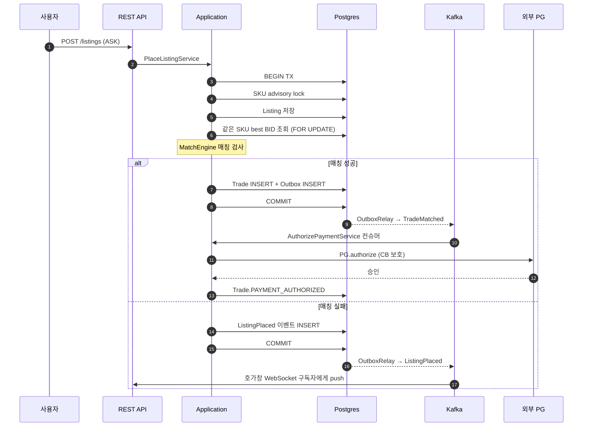
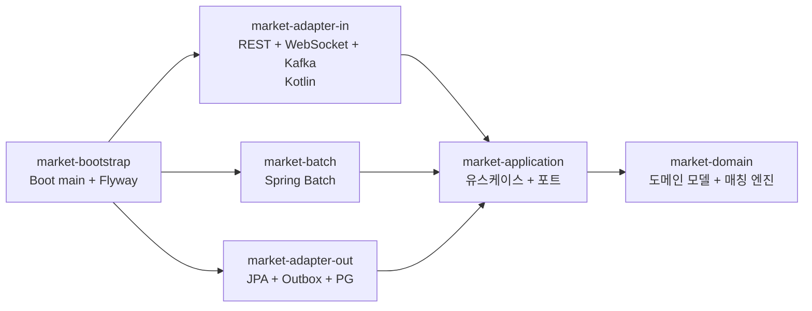
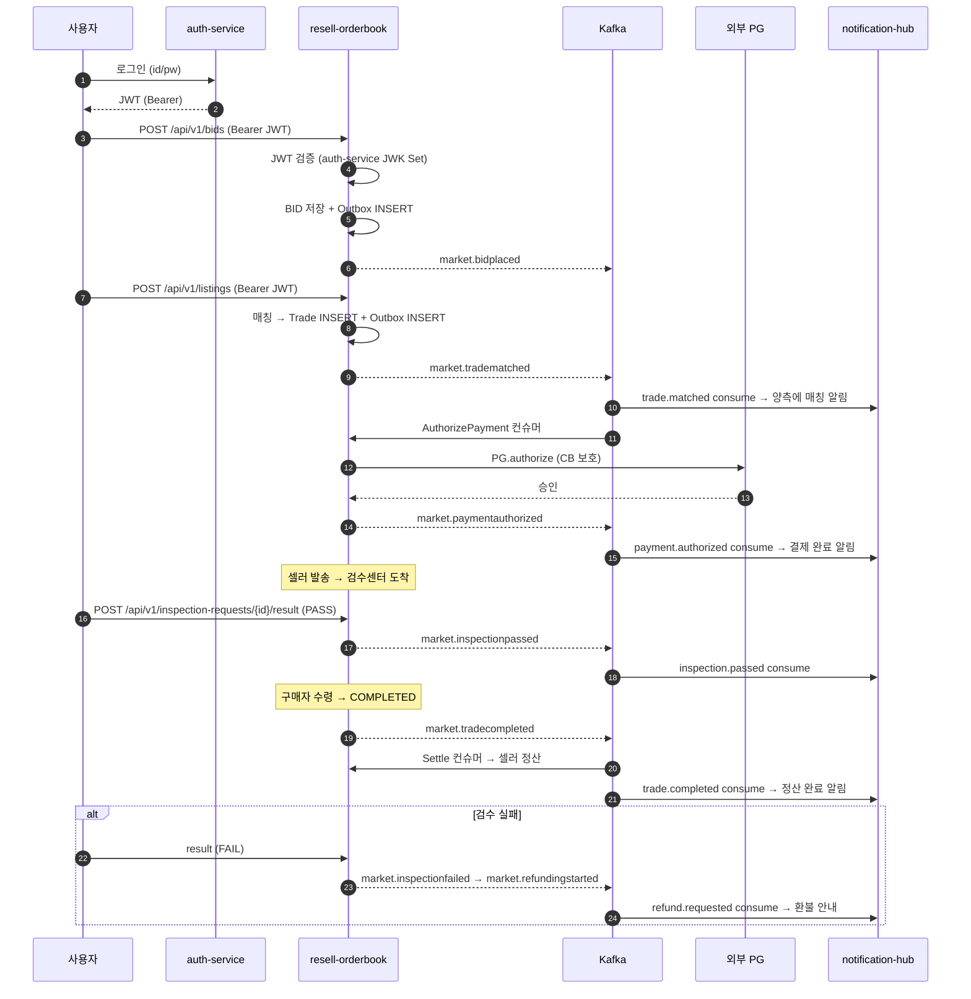

# Resell Orderbook

한정판 리셀 마켓의 백엔드입니다. 같은 상품에 들어온 판매 호가(ASK)와 구매 호가(BID)를
자동으로 매칭하고, 결제, 검수, 배송, 정산까지 거래 라이프사이클 전 과정을 처리합니다.

도메인은 한정판 스니커즈 리셀 거래소를 가정합니다 — 동일 SKU 의 ASK/BID 가 가격 조건이
맞으면 즉시 체결되고, 검수센터를 거쳐 구매자에게 배송, 마지막에 판매자에게 정산이
이루어지는 흐름입니다.

## 기술 스택

- **Language**: Java 21, Kotlin (adapter-in 모듈)
- **Framework**: Spring Boot 3.4.1, Spring Modulith, Spring Batch
- **Database**: PostgreSQL 16, Redis
- **Messaging**: Apache Kafka
- **Security**: Spring Security (OAuth2 Resource Server, JWT)
- **Resilience**: Resilience4j (서킷 브레이커, 재시도)
- **Build / CI**: Gradle 8, GitHub Actions, Docker, Kubernetes

## 주요 요구사항

- **이중 체결 방지**: 인기 상품 호가에 동시에 여러 매칭 요청이 몰려도 한 번만 체결되어야 합니다.
- **거래 흐름 안전성**: 매칭부터 정산까지 7~10 단계의 흐름 중 외부 시스템(PG, 검수 업체, 은행)
  장애 시에도 데이터가 깨지지 않아야 합니다.
- **검수 실패 시 자동 환불**: 가품 또는 하자 발견 시 검수비, 배송비를 포함한 전액을 구매자에게
  환불합니다.
- **수수료 정책 동결**: 수수료 정책이 변경되어도 과거 거래의 정산 금액은 변하지 않아야 합니다.
- **실시간 호가창**: 폴링이 아닌 push 방식으로 호가창을 갱신합니다.

## 핵심 설계 결정

### 1. 동시 호가 매칭 직렬화

`pg_advisory_xact_lock(sku_id)` (PostgreSQL 이 제공하는, 트랜잭션 단위로 잡는 응용 락) 와
`FOR UPDATE SKIP LOCKED` (다른 트랜잭션이 잠근 행은 건너뛰고 잠그지 않은 행만 가져오는
SQL 옵션) 를 조합해 같은 SKU 의 매칭만 한 줄로 줄세우고, 다른 SKU 는 병렬로 처리합니다.
잠금 경쟁 범위를 SKU 단위로 좁혀 처리량을 확보했습니다.

### 2. Saga 기반 거래 라이프사이클

매칭 이후의 흐름(결제 승인 → 배송 → 검수 → 정산)을 코레오그래피 Saga (중앙 조정자 없이
각 단계가 이벤트만 보고 다음 단계를 알아서 진행하는 분산 트랜잭션 패턴) 로 구성했습니다.
각 단계가 독립된 Kafka 컨슈머 (큐에서 메시지를 받아 처리하는 모듈) 로 동작하므로 한 단계
장애가 다른 단계로 번지지 않습니다.

### 3. Outbox 패턴으로 이벤트 발행 안전성 확보

DB 커밋과 Kafka 이벤트 발행이 항상 함께 성공하거나 함께 실패하도록 보장합니다. 도메인
트랜잭션 안에서 outbox 테이블 (보낼 이벤트를 잠시 모아두는 테이블) 에 이벤트를 INSERT 하고,
별도 OutboxRelay 가 주기적으로 미발행 건을 읽어 Kafka 로 전송합니다.

### 4. 외부 PG 장애 격리

Resilience4j 서킷 브레이커 (외부 호출 실패율이 임계치를 넘으면 호출을 즉시 차단해 자기
시스템을 보호하는 장치), 재시도, fallback 을 적용했습니다. 차단 상태에서는 우리 측
트랜잭션을 즉시 종료하여, 결제사 PG 의 긴 응답 지연이 우리 처리에 영향을 주지 않도록
했습니다.

### 5. 수수료 정책 동결 (Fee Snapshot)

거래 시점의 수수료 명세(`FeeSnapshot`, 매칭이 성사된 순간의 수수료 계산서를 그대로 보관한
스냅샷) 를 거래 레코드에 함께 저장합니다. 정책이 바뀌어도 과거 거래는 저장된 명세 그대로
정산됩니다.

### 6. 실시간 호가창 (WebSocket)

호가 등록과 체결 이벤트가 발생하면, 해당 SKU 를 구독 중인 클라이언트에게 호가창 스냅샷을
서버가 직접 보내줍니다 (push). 5초마다 새로고침하는 방식 (polling) 보다 즉시 반영됩니다.

설계 결정의 상세 배경은 [docs/adr/](docs/adr/) 의 ADR 27건에 정리되어 있습니다.

## 시스템 흐름



## 모듈 구조

Spring Modulith 가 모듈 간 의존 방향을 빌드 시점에 검증합니다.



| 모듈 | 책임 |
|---|---|
| `market-domain` | 순수 도메인 모델 (Spring 런타임 의존성 없음). 매칭 엔진, 거래 상태머신, 수수료 계산 |
| `market-application` | 유스케이스, 외부 포트 인터페이스 |
| `market-adapter-in` | REST 컨트롤러, WebSocket, Kafka Saga 컨슈머 (Kotlin) |
| `market-adapter-out` | JPA, Outbox, Redis, 외부 PG 클라이언트, S3 |
| `market-batch` | 만료 호가 정리, TTL 초과 거래 자동 취소 |
| `market-bootstrap` | Spring Boot 진입점, Flyway, Modulith 검증 |
| `e2e-tests` | Postgres Testcontainer 기반 통합 시나리오 |

## 실행 방법

H2 와 Mock PG 를 사용하여 외부 의존성 없이 실행할 수 있습니다.

```bash
./gradlew :market-bootstrap:bootRun

# 다른 터미널에서 데모 시나리오 실행
./scripts/demo.sh
```

데모는 상품 등록 → BID(160,000원) 등록 → 호가창 조회 → ASK(140,000원) 등록 → 즉시 매칭 →
거래 조회 → 멱등성 검증의 한 사이클을 자동으로 실행합니다.

- API 문서: <http://localhost:8080/swagger>
- STOMP 호가창: endpoint `http://localhost:8080/ws`, subscribe `/topic/orderbook/{skuId}`
- Legacy raw WebSocket: `ws://localhost:8080/ws/orderbook?skuId=<uuid>`

## 매칭 코드 예시

판매 호가 등록 시 한 트랜잭션 안에서 일어나는 일입니다.

```java
// 멱등성 키 점유 (같은 요청이 두 번 와도 한 번만 처리되게 차단)
idempotencyKeys.acquireOrThrow(cmd.idempotencyKey());

// SKU 단위 직렬화 — 같은 상품의 매칭이 동시에 돌지 않도록 한 줄로 줄세움
orderBook.acquireSkuLock(cmd.skuId());

// 새 ASK 저장 후, 같은 SKU 의 가장 높은 BID 를 잠그면서 조회 (다른 트랜잭션이 동시에
// 매칭하지 못하도록 행 잠금)
listings.save(Listing.place(cmd.skuId(), cmd.sellerId(), cmd.askPrice(), now));
Optional<Bid> highestBid = orderBook.findHighestBidForUpdate(cmd.skuId(), now);

// 매칭 엔진은 순수 함수 (입력만으로 결과가 결정되고 부수효과 없음) 로 가격 비교,
// 자기 호가에 자기가 체결되는 것 (self-trade) 차단, 먼저 들어온 호가 가격 (maker price)
// 결정을 수행
Optional<Trade> trade = MatchEngine.matchNewAsk(listing, highestBid, feePolicy, now);

trade.ifPresentOrElse(t -> {
    listing.markMatched(t.id());
    bid.markMatched(t.id());
    trades.save(t);
    events.publish(t.matched(now));      // Outbox 테이블 INSERT, DB 커밋과 같은 트랜잭션
}, () -> events.publish(listing.placed(now)));
// 이후 OutboxRelay 가 주기적으로 Kafka 발행, Saga 다음 단계 컨슈머가 결제 승인 진행
```

## 테스트 및 빌드

```bash
./gradlew check                       # 전체 (263개)
./gradlew :market-domain:test         # 도메인 단위
./gradlew :market-bootstrap:bootJar   # 배포용 jar 생성
```

| 모듈 | 테스트 수 | 검증 |
|---|---|---|
| domain | 94 | Money, Listing/Bid 불변식, 매칭 엔진, 거래 상태머신, 수수료 계산, MarketStats / OHLC 집계, Snowflake ID |
| application | 77 | 매칭/결제/검수/환불/정산 서비스, 토큰 버킷 rate limiter, saga 보상 멱등성 (mock 기반) |
| adapter-in | 22 | TradingController / 호가창 STOMP / 인증 추출기 / GlobalExceptionHandler slice |
| adapter-out | 54 | Mock PG, Wiremock IT, Resilience4j CB, Redis Testcontainer (2단 캐시 + pub/sub invalidation), Bulkhead, Outbox relay |
| bootstrap | 8 | Modulith verify, application context smoke, 모듈 다이어그램 자동 생성 |
| e2e-tests | 8 | Postgres 위 매칭, 전체 라이프사이클, 검수 실패 환불, 동시 매칭 race |

## 운영 프로필 (`prod`)

`SPRING_PROFILES_ACTIVE=prod` 일 때 활성화되는 항목입니다.

- PostgreSQL, Redis, Kafka 실제 사용
- 외부 PG 호출에 Resilience4j 적용 (dev 는 Mock)
- 멱등성 (같은 요청을 여러 번 받아도 한 번만 처리되도록 보장하는 성질) 키를 Redis SETNX
  (이미 키가 있으면 거부하는 원자적 SET 명령) 로 처리 (dev 는 메모리 내 저장소)
- `pg_advisory_xact_lock` 활성화 (H2 는 미지원이므로 dev 비활성)
- OAuth2 Resource Server (JWT 토큰을 검증해 사용자를 식별하는 표준) 인증 (dev 는 모두 통과
  + `X-User-Id` 헤더로 사용자 흉내)
- Outbox Relay (DB 에 쌓인 미발행 이벤트를 주기적으로 Kafka 로 보내는 컴포넌트) 활성화

## 인프라

- `infrastructure/Dockerfile`: multi-stage 빌드 (JDK 21 build → JRE 21 Alpine), non-root, ZGC
- `infrastructure/k8s/`: PSS restricted, IRSA, PodDisruptionBudget, HPA, startup probe + preStop
  + graceful shutdown (ADR-0027)
- `helm/resell-orderbook/`: 위 raw manifests 를 그대로 옮긴 Helm chart (아래 절 참고)
- `infrastructure/docker-compose.yml`: 로컬 통합 환경 (postgres, redis, kafka, wiremock)
- `.github/workflows/ci.yml`: 단위 테스트 → e2e → 정적 분석 → 이미지 빌드 + Trivy 스캔

### Helm chart

`infrastructure/k8s/` 의 raw manifests 와 같은 구성을 Helm chart 로 묶었습니다. 다중 환경
(dev / staging / prod) 에서 image tag, replicas, secret 참조 방식만 바꿔 끼울 수 있도록
values 로 모았습니다.

```
helm/resell-orderbook/
├── Chart.yaml
├── values.yaml          # dev 기본값 (replicas 1, wiremock on, NetworkPolicy off)
├── values-prod.yaml     # 운영 오버라이드 (replicas 3, HPA, ingress TLS, NP 활성, secret 참조)
└── templates/           # deployment / service / configmap / secret / serviceaccount
                         # / ingress / hpa / pdb / networkpolicy / wiremock / NOTES.txt
```

운영 배포:

```bash
# Postgres password / PG webhook secret 은 chart 밖에서 미리 생성 (예: SealedSecrets, ESO)
kubectl -n market create secret generic market-postgres \
  --from-literal=password='...'
kubectl -n market create secret generic market-pg-webhook \
  --from-literal=webhook-secret='...'

helm upgrade --install resell-orderbook ./helm/resell-orderbook \
  -n market --create-namespace \
  -f helm/resell-orderbook/values-prod.yaml \
  --set image.tag=$(git rev-parse --short HEAD)
```

dev 클러스터 (kind / minikube) 에서 외부 의존 없이:

```bash
helm upgrade --install ro ./helm/resell-orderbook -n market --create-namespace
# wiremock 이 같은 chart 안에서 함께 떠서 외부 PG 호출이 mock 으로 닫힘.
```

검증:

```bash
helm lint helm/resell-orderbook
helm lint helm/resell-orderbook -f helm/resell-orderbook/values-prod.yaml
helm template ro helm/resell-orderbook -n market
helm template ro helm/resell-orderbook -n market -f helm/resell-orderbook/values-prod.yaml
```

매칭 엔진 in-flight 처리 보호 (`terminationGracePeriodSeconds: 60` + preStop sleep + Spring
graceful shutdown) 와 Saga REQUIRES_NEW 격리 가정은 raw manifests 와 동일합니다 — 자세한
배경은 `values.yaml` 의 주석과 ADR-0027.

## 향후 개선 사항

- Elasticsearch 기반 상품 검색
- 검수 사진 ML 기반 가품 탐지
- 운영자 대시보드 (검수 큐, 정산 현황)

## Portfolio Set 통합

이 레포는 단독으로도 동작하지만, 같은 사용자가 운영하는 8개 백엔드 레포가 한 시스템처럼
맞물리는 구성의 일부입니다. 프로필 README:
<https://github.com/ssa1004/ssa1004>.

### 8 레포 한눈 표

| 레포 | 역할 | 본 레포 (resell-orderbook) 와의 관계 |
|---|---|---|
| `auth-service` | 사용자 인증 + JWT 발급 | 본 레포가 JWK Set 으로 들어오는 JWT 를 검증 |
| `security-log-search` | 보안 로그 수집/검색 | 본 레포의 인증 실패 / 권한 위반 로그를 인덱싱 (선택) |
| `notification-hub` | 다채널 알림 (이메일/푸시/SMS) | 본 레포의 거래/결제/검수 이벤트를 구독해 발송 |
| `search-service` | 상품 검색 | 본 레포의 상품/체결가 데이터를 색인 (선택) |
| `billing-platform` | 사용량 과금 | 본 레포의 거래 수수료를 usage 로 전송 (선택) |
| **`resell-orderbook`** | **본 레포 — 한정판 리셀 마켓 백엔드** | — |
| `gpu-job-orchestrator` | GPU job 스케줄러 | 검수 사진 ML 가품 탐지 워커 (향후) |
| `mini-shop-observability` | 관측 스택 (Prometheus/Grafana/Tempo/Loki) | 본 레포의 metrics/trace/log 수집 |

### 들어오는 / 나가는 통합점

- **들어오는** — `auth-service` 가 발급한 JWT (Bearer) 로 호가 등록 / 거래 / 검수 endpoint 호출.
  PG 결제 결과는 wiremock 으로 도는 외부 PG 를 통해 도착.
- **나가는** — 거래 라이프사이클의 각 상태 전이가 outbox 를 거쳐 Kafka 로 발행되고,
  `notification-hub` 가 토픽 (`market.tradematched`, `market.paymentauthorized`,
  `market.inspectionpassed`, `market.inspectionfailed`, `market.tradecompleted`,
  `market.refundingstarted`) 을 구독해 사용자에게 알림.

### 사용자 라이프사이클 sequence

호가 등록부터 정산까지의 한 사이클과, 각 단계에서 발행되는 이벤트입니다.



### 통합 시연 — 외부 의존을 mock 으로 닫고 한 머신에서 한 사이클

```bash
# 1. 통합 환경 기동 (postgres + redis + kafka + auth stub + notification stub + wiremock + 본 앱)
docker compose -p resell-integration -f infrastructure/docker-compose.integration.yml up -d --build

# 2. mock JWT 발급 → bid/ask 매칭 → 결제 → 검수 → 정산까지 자동 진행
./scripts/integration-demo.sh

# 3. notification-hub stub 이 받은 이벤트 확인
docker compose -p resell-integration -f infrastructure/docker-compose.integration.yml logs notification-hub-stub | tail -30

# 4. 정리
docker compose -p resell-integration -f infrastructure/docker-compose.integration.yml down -v
```

`-p` 로 compose 프로젝트 이름을 명시 — 같은 머신에서 다른 포폴 레포의 compose 와 동시에
띄울 때 이름 / 포트 충돌을 피한다 (본 앱: `8081`, auth-stub: `8087`).

`auth-service` 와 `notification-hub` 의 실제 레포 대신 같은 계약을 충족하는 stub 을 사용합니다 —
각 레포가 같은 JWK Set 형식과 같은 Kafka 토픽 이름을 공유하므로, 운영에서는 stub 자리를
실제 서비스로 바꾸기만 하면 됩니다.
