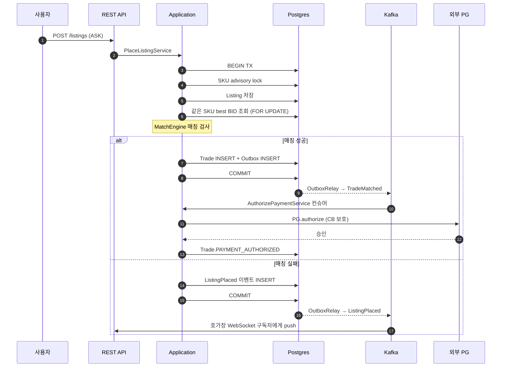
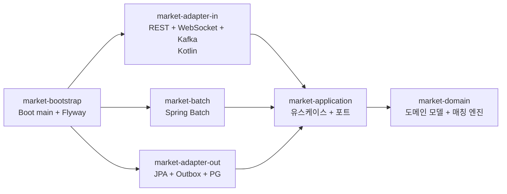

# Resell Orderbook

한정판 리셀 마켓의 백엔드입니다. 같은 상품에 들어온 판매 호가(ASK)와 구매 호가(BID)를
자동으로 매칭하고, 결제, 검수, 배송, 정산까지 거래 라이프사이클 전 과정을 처리합니다.

KREAM, StockX 와 같은 리셀 거래소 서비스를 모티브로 삼았습니다.

## 기술 스택

- **Language**: Java 21, Kotlin (adapter-in 모듈)
- **Framework**: Spring Boot 3.3, Spring Modulith, Spring Batch
- **Database**: PostgreSQL 16, Redis
- **Messaging**: Apache Kafka
- **Security**: Spring Security (OAuth2 Resource Server, JWT)
- **Resilience**: Resilience4j (서킷 브레이커, 재시도)
- **Build / CI**: Gradle 8, GitHub Actions, Docker, Kubernetes

## 주요 요구사항

- **이중 체결 방지**: 인기 상품 호가에 동시에 여러 매칭 요청이 몰려도 한 번만 체결되어야 합니다.
- **거래 흐름 안전성**: 매칭부터 정산까지 7~10 단계의 흐름 중 외부 시스템(PG, 검수 업체, 은행)
  장애 시에도 데이터가 깨지지 않아야 합니다.
- **검수 실패 시 자동 환불**: 가품 또는 하자 발견 시 검수비, 배송비를 포함한 전액을 구매자에게
  환불합니다.
- **수수료 정책 동결**: 수수료 정책이 변경되어도 과거 거래의 정산 금액은 변하지 않아야 합니다.
- **실시간 호가창**: 폴링이 아닌 push 방식으로 호가창을 갱신합니다.

## 핵심 설계 결정

### 1. 동시 호가 매칭 직렬화

`pg_advisory_xact_lock(sku_id)` 와 `FOR UPDATE SKIP LOCKED` 를 조합하여 같은 SKU 의 매칭만
직렬화하고 다른 SKU 는 병렬 처리합니다. 락 경합 범위를 SKU 단위로 좁혀 처리량을 확보했습니다.

### 2. Saga 기반 거래 라이프사이클

매칭 이후의 흐름(결제 승인 → 배송 → 검수 → 정산)을 코레오그래피 Saga 로 구성했습니다. 각
단계가 독립된 Kafka 컨슈머로 동작하므로 한 단계 장애가 다른 단계로 전파되지 않습니다.

### 3. Outbox 패턴으로 이벤트 발행 안전성 확보

DB 커밋과 Kafka 이벤트 발행의 원자성을 보장합니다. 도메인 트랜잭션 안에서 outbox 테이블에
이벤트를 INSERT 하고, 별도 OutboxRelay 가 polling 으로 미발행 건을 Kafka 로 전송합니다.

### 4. 외부 PG 장애 격리

Resilience4j 서킷 브레이커, 재시도, fallback 을 적용했습니다. CB OPEN 상태에서는 우리 측
트랜잭션을 즉시 종료하여 PG 의 long timeout 이 우리 처리에 영향을 주지 않도록 했습니다.

### 5. 수수료 정책 동결 (Fee Snapshot)

거래 시점의 수수료 명세(`FeeSnapshot`)를 거래 레코드에 함께 저장합니다. 정책이 변경되어도
과거 거래는 저장된 명세 그대로 정산됩니다.

### 6. 실시간 호가창 (WebSocket)

호가 등록과 체결 이벤트가 발생하면 해당 SKU 를 구독 중인 클라이언트에게 호가창 스냅샷을
push 합니다.

설계 결정의 상세 배경은 [docs/adr/](docs/adr/) 의 ADR 12건에 정리되어 있습니다.

## 시스템 흐름



## 모듈 구조

Spring Modulith 가 모듈 간 의존 방향을 빌드 시점에 검증합니다.



| 모듈 | 책임 |
|---|---|
| `market-domain` | 순수 도메인 모델 (Spring 의존성 없음). 매칭 엔진, 거래 상태머신, 수수료 계산 |
| `market-application` | 유스케이스, 외부 포트 인터페이스 |
| `market-adapter-in` | REST 컨트롤러, WebSocket, Kafka Saga 컨슈머 (Kotlin) |
| `market-adapter-out` | JPA, Outbox, Redis, 외부 PG 클라이언트, S3 |
| `market-batch` | 만료 호가 정리, TTL 초과 거래 자동 취소 |
| `market-bootstrap` | Spring Boot 진입점, Flyway, Modulith 검증 |
| `e2e-tests` | Postgres Testcontainer 기반 통합 시나리오 |

## 실행 방법

H2 와 Mock PG 를 사용하여 외부 의존성 없이 실행할 수 있습니다.

```bash
./gradlew :market-bootstrap:bootRun

# 다른 터미널에서 데모 시나리오 실행
./scripts/demo.sh
```

데모는 상품 등록 → BID(160,000원) 등록 → 호가창 조회 → ASK(140,000원) 등록 → 즉시 매칭 →
거래 조회 → 멱등성 검증의 한 사이클을 자동으로 실행합니다.

- API 문서: <http://localhost:8080/swagger>
- 호가창 WebSocket: `ws://localhost:8080/ws/orderbook?skuId=<uuid>`

## 매칭 코드 예시

판매 호가 등록 시 한 트랜잭션 안에서 일어나는 일입니다.

```java
// 멱등성 키 점유 (중복 요청 차단)
idempotencyKeys.acquireOrThrow(cmd.idempotencyKey());

// SKU 단위 직렬화 — 같은 상품의 매칭이 동시에 돌지 않도록
orderBook.acquireSkuLock(cmd.skuId());

// 새 ASK 저장 후, 같은 SKU 의 가장 높은 BID 를 잠금하며 조회
listings.save(Listing.place(cmd.skuId(), cmd.sellerId(), cmd.askPrice(), now));
Optional<Bid> highestBid = orderBook.findHighestBidForUpdate(cmd.skuId(), now);

// 매칭 엔진은 순수 함수로 가격 비교, self-trade 차단, maker 가격 결정을 수행
Optional<Trade> trade = MatchEngine.matchNewAsk(listing, highestBid, feePolicy, now);

trade.ifPresentOrElse(t -> {
    listing.markMatched(t.id());
    bid.markMatched(t.id());
    trades.save(t);
    events.publish(t.matched(now));      // Outbox INSERT, DB 커밋과 함께 commit
}, () -> events.publish(listing.placed(now)));
// 이후 OutboxRelay 가 polling 으로 Kafka 발행, Saga 다음 단계 컨슈머가 결제 승인 진행
```

## 테스트 및 빌드

```bash
./gradlew test                        # 전체 (107개)
./gradlew :market-domain:test         # 도메인 단위
./gradlew :market-bootstrap:bootJar   # 배포용 jar 생성
```

| 모듈 | 테스트 수 | 검증 |
|---|---|---|
| domain | 55 | Money, Listing/Bid 불변식, 매칭 엔진, 거래 상태머신, 수수료 계산 |
| application | 25 | 매칭/결제/검수/환불/정산 서비스 (mock) |
| adapter-out | 16 | Mock PG, Wiremock IT, Resilience4j CB, Redis Testcontainer |
| adapter-in | 3 | TradingController slice (standalone MockMvc) |
| bootstrap | 2 | Modulith verify, 모듈 다이어그램 자동 생성 |
| e2e-tests | 6 | Postgres 위 매칭, 전체 라이프사이클, 검수 실패 환불 |

## 운영 프로필 (`prod`)

`SPRING_PROFILES_ACTIVE=prod` 일 때 활성화되는 항목입니다.

- PostgreSQL, Redis, Kafka 실제 사용
- 외부 PG 호출에 Resilience4j 적용 (dev 는 Mock)
- 멱등성 키를 Redis SETNX 로 처리 (dev 는 in-memory)
- `pg_advisory_xact_lock` 활성화 (H2 는 미지원이므로 dev 비활성)
- OAuth2 Resource Server (JWT) 인증 (dev 는 모두 통과 + `X-User-Id` 헤더 시뮬레이션)
- Outbox Relay 활성화 → Kafka publish

## 인프라

- `infrastructure/Dockerfile`: multi-stage 빌드 (JDK 21 build → JRE 21 Alpine), non-root, ZGC
- `infrastructure/k8s/`: PSS restricted, IRSA, PodDisruptionBudget, HPA
- `infrastructure/docker-compose.yml`: 로컬 통합 환경 (postgres, redis, kafka, wiremock)
- `.github/workflows/ci.yml`: 단위 테스트 → e2e → 정적 분석 → 이미지 빌드 + Trivy 스캔

## 향후 개선 사항

- Elasticsearch 기반 상품 검색
- 시계열 가격 차트 (TimescaleDB)
- 검수 사진 ML 기반 가품 탐지
- 운영자 대시보드 (검수 큐, 정산 현황)
